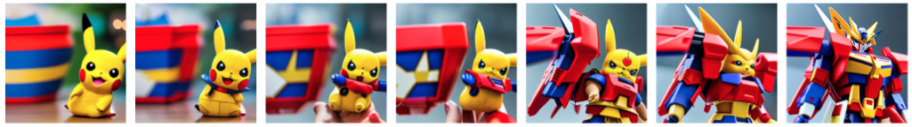
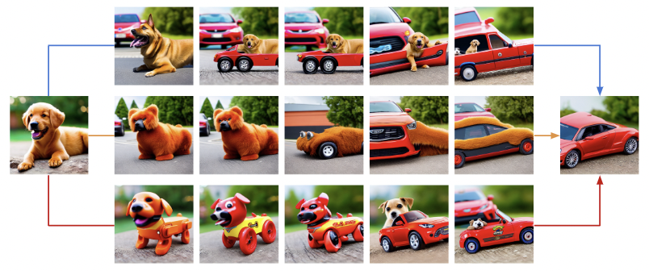

<p align="center">
  
</p>

### <div align="center">(P)AID: (Prompt-guided) Attention Interpolation of Text-to-Image Diffusion<div> 

<div align="center">
<a herf=https://arxiv.org/abs/xxxx></a> <a herf=https://colab.research.google.com/drive/1zC-iOVu_raiFdUAD-TQ76GPKAuIj4hIt?usp=sharing></a>
<a herf=>
</div>

<p align="center">
  <br>
  <a href="https://qy-h00.github.io" target="_blank">He Qiyuan</a><sup>1</sup>,&nbsp;
  <a href="https://king159.github.io/" target="_blank">Wang Jinghao</a><sup>2</sup>,&nbsp;
  <a href="https://liuziwei7.github.io/" target="_blank">Liu Ziwei</a><sup>2</sup>,&nbsp;
  <a href="https://www.comp.nus.edu.sg/~ayao//" target="_blank">Angela Yao</a><sup>1,&#x2709</sup>;
  </sup></a>
  <br>
  <a herf=https://cvml.comp.nus.edu.sg>Computer Vision & Machine Learning Group, National University of Singapore</a> <sup>1</sup>
  <br>
  S-Lab, Nanyang Technological University <sup>2</sup>
  <br>
  <sup>&#x2709;</sup> Corresponding Author
</p>




## Release

[03/2024] Code and papar are publicly available.

## Abstract

<b>TL; DR: <font color="red">AID</font> is a method that enables diffusion model to interpolate between two text prompts. Its variant, PAID, provides further control of the interpolation results via prompt guidance.</b>

## Google Colab

Directly try PAID [here](https://colab.research.google.com/drive/1zC-iOVu_raiFdUAD-TQ76GPKAuIj4hIt?usp=sharing) using Google's Free GPU!

## Local Setup

1. Clone the repository and install the requirements:

``` bash
git clone https://github.com/QY-H00/attention-interpolation-diffusion.git
cd attention-interpolation-diffusion
pip install requirements.txt
```

2. Go to `play.ipynb` for fun!

## Play with PAID

Our method provides customized and rich configurations for users to play with and freely adjust to achieve very different and interesting interpolation results. Here are some examples:

### Different $\alpha$ and $\beta$ of the Beta prior

### Number of Warm-up steps

### Inner/Outer Interpolated of Attention

### Fused with Self-attention

### Prompt-guided Interpolation

## Supporting Models

Currently, we support the following models:

- [Stable Diffusion 1.4](https://huggingface.co/CompVis/stable-diffusion-v1-4)
- [Stable Diffusion 1.5](https://huggingface.co/runwayml/stable-diffusion-v1-5)

## Citation

If you found this repository/our paper useful, please consider citing:

``` bibtex
@article{,
  title={},
  author={},
  journal={},
  year={}
}
```

## Acknowledgement

We thank the authors of the original Diffusion models for their wonderful work and open-sourcing the codebase.
