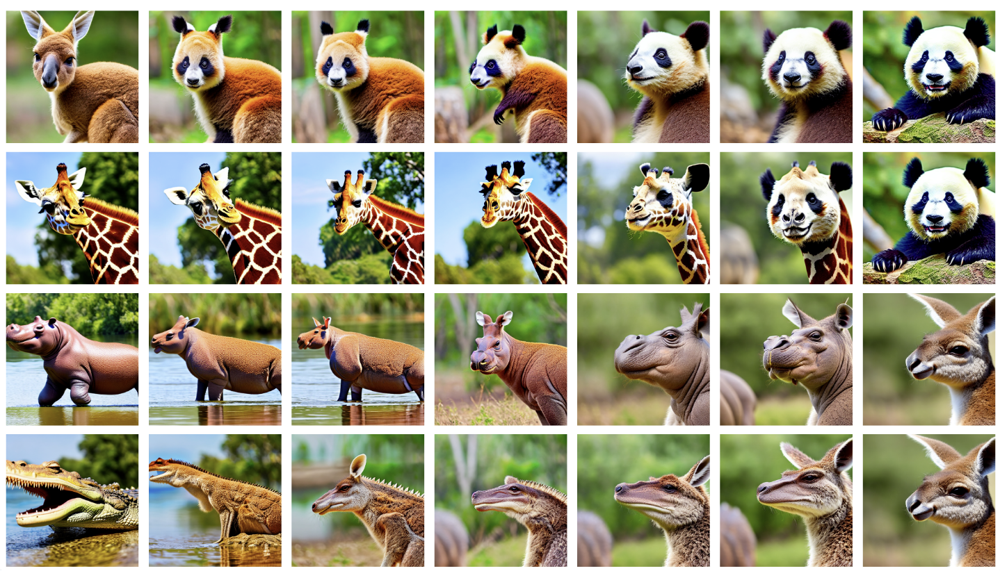
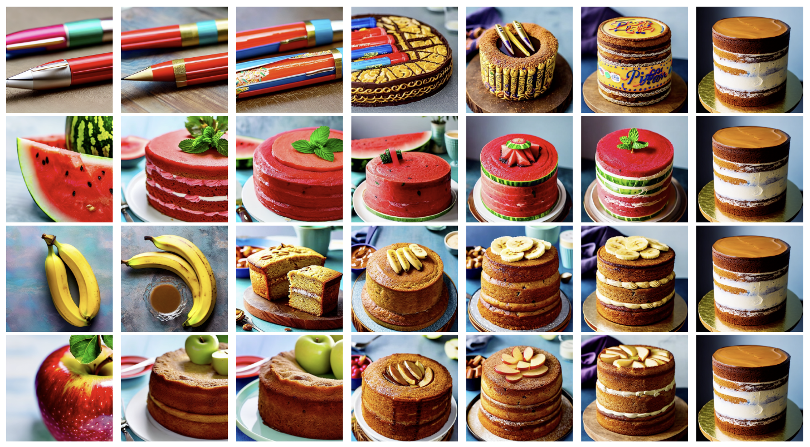
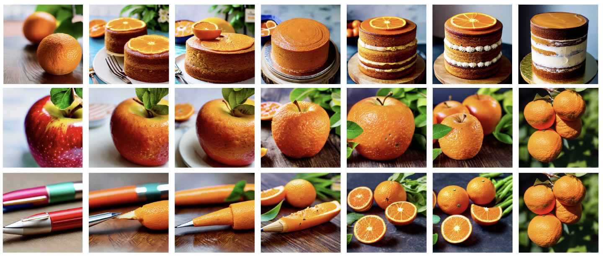

<p align="center">
  
</p>

### <div align="center">(P)AID: (Prompt-guided) Attention Interpolation of Text-to-Image Diffusion<div>

<div align="center">
<a herf=https://arxiv.org/abs/xxxx></a>
<a herf=https://colab.research.google.com/drive/1zC-iOVu_raiFdUAD-TQ76GPKAuIj4hIt?usp=sharing></a>
<a herf=>
<a herf=>
</div>

<p align="center">
  <br>
  <a href="https://qy-h00.github.io" target="_blank">He Qiyuan</a><sup>1</sup>,&nbsp;
  <a href="https://king159.github.io/" target="_blank">Wang Jinghao</a><sup>2</sup>,&nbsp;
  <a href="https://liuziwei7.github.io/" target="_blank">Liu Ziwei</a><sup>2</sup>,&nbsp;
  <a href="https://www.comp.nus.edu.sg/~ayao//" target="_blank">Angela Yao</a><sup>1,&#x2709</sup>;
  </sup></a>
  <br>
  <a herf=https://cvml.comp.nus.edu.sg>Computer Vision & Machine Learning Group, National University of Singapore</a> <sup>1</sup>
  <br>
  S-Lab, Nanyang Technological University <sup>2</sup>
  <br>
  <sup>&#x2709;</sup> Corresponding Author
</p>

## 📌 Release

[03/2024] Code and paper are publicly available.

## 📑 Abstract

<b>TL; DR: <font color="red">AID</font> is a method that enables diffusion model to interpolate between two text prompts. Its variant, PAID, provides further control of the interpolation via prompt guidance.</b>

## ▶️ Play with PAID

### Realist Style

<p align="center">
Pikachu -> Gundam

</p>

<p align="center">
Computer -> Phone

</p>

### Anime Style

<p align="center">
Ninja -> Cat

</p>

<p align="center">
Ninja -> Dog

</p>

### Oil-Painting Style

<p align="center">
Starry night -> Mona Lisas

</p>

<p align="center">
SkyCraper -> Town

</p>

## 🏍️ Google Colab

Directly try PAID [here](https://colab.research.google.com/drive/1zC-iOVu_raiFdUAD-TQ76GPKAuIj4hIt?usp=sharing) using Google's Free GPU!

## 🚗 Local Setup

1. Clone the repository and install the requirements:

``` bash
git clone https://github.com/QY-H00/attention-interpolation-diffusion.git
cd attention-interpolation-diffusion
pip install requirements.txt
```

2. Go to `play.ipynb` for fun!

## 🎲 Customized Interpolation

Our method offers users customized and diverse configurations to experiment with, allowing them to freely adjust settings and achieve a wide range of interesting interpolation results. Here are some examples:

### Prompt guidance

#### 1. "A dog driving car"

<p align="center">

</p>

#### 2. "A car with dog furry texture"

<p align="center">

</p>

#### 3. "A toy named dog-car"

<p align="center">

</p>

#### 4. "A painting of car and dog drawn by Vincent van Gogh"

<p align="center">

</p>

### $\alpha$ and $\beta$ of the Beta prior

#### 1. $\alpha=1, \beta=1$

<p align="center">

</p>

#### 2. $\alpha=1, \beta=8$

<p align="center">

</p>

#### 3. $\alpha=8, \beta=1$

<p align="center">

</p>

### Inner/Outer Interpolated of Attention

#### 1. Inner


#### 2. Outer


### Number of Warm-up steps

## 📝 Supporting Models

We support the following models:

- Stable Diffusion 1.4: [CompVis/stable-diffusion-v1-4](https://huggingface.co/CompVis/stable-diffusion-v1-4)
- Stable Diffusion 1.5: [runwayml/stable-diffusion-v1-5](https://huggingface.co/runwayml/stable-diffusion-v1-5)
- Stable Diffusion 2.1: [stabilityai/stable-diffusion-2-1](https://huggingface.co/stabilityai/stable-diffusion-2-1)
- Stable Diffusion XL: [stabilityai/stable-diffusion-xl-base-1.0](https://huggingface.co/stabilityai/stable-diffusion-xl-base-1.0)
  
## ✒️Citation

If you found this repository/our paper useful, please consider citing:

``` bibtex
@article{,
  title={},
  author={},
  journal={},
  year={}
}
```

## ❤️ Acknowledgement

We thank the following repositories for their great work: [diffusers](https://github.com/huggingface/diffusers), [transformers](https://github.com/huggingface/transformers).

## ➕️ More Results

### Animals

<p align="center">

</p>

<p align="center">

</p>

### Objects

<p align="center">

</p>

<p align="center">

</p>