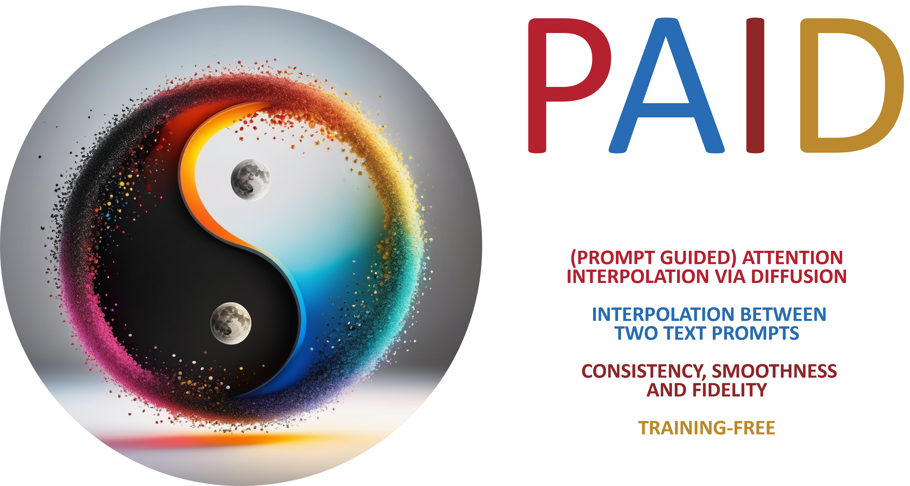

<p align="center">
  
</p>

### <div align="center">PAID: (Prompt-guided) Attention Interpolation of Text-to-Image Diffusion<div>

<p align="center">
Accepted in NeurIPS 2024
</p>

<div align="center">
<a href=https://arxiv.org/abs/2403.17924 target="_blank"></a>
<a href=https://huggingface.co/spaces/king159/PAID target="_blank"></a>
<a href=https://colab.research.google.com/drive/1D2myS9UF241gx1otp-fy-LRakMZlROCT?usp=sharing target="_blank"></a>
<a href=https://qy-h00.github.io/attention-interpolation-diffusion target="_blank"></a>
</div>

<p align="center">
  <br>
  <a href="https://qy-h00.github.io" target="_blank">He Qiyuan</a><sup>1</sup>,&nbsp;
  <a href="https://king159.github.io/" target="_blank">Wang Jinghao</a><sup>2</sup>,&nbsp;
  <a href="https://liuziwei7.github.io/" target="_blank">Liu Ziwei</a><sup>2</sup>,&nbsp;
  <a href="https://www.comp.nus.edu.sg/~ayao//" target="_blank">Angela Yao</a><sup>1,&#x2709</sup>;
  </sup></a>
  <br>
  <a herf=https://cvml.comp.nus.edu.sg>Computer Vision & Machine Learning Group, National University of Singapore</a> <sup>1</sup>
  <br>
  S-Lab, Nanyang Technological University <sup>2</sup>
  <br>
  <sup>&#x2709;</sup> Corresponding Author
</p>

## 📌 Release
[10/2024] PAID is accepted by NeurIPS 2024 (Poster)!
[03/2024] Code and paper are publicly available.

## 📑 Abstract

<b>TL;DR: <font color="red">AID</font> (Attention Interpolation via Diffusion)</b> is a training-free method that enables the text-to-image diffusion model to generate interpolation between different conditions with high consistency, smoothness and fidelity. Its variant, <font color="blue">PAID</font>, provides further control of the interpolation via prompt guidance.

<details><summary>CLICK for the full abstract</summary>
Conditional diffusion models can create unseen images in various settings, aiding image interpolation. Interpolation in latent spaces is well-studied, but interpolation with specific conditions like text or poses is less understood. Simple approaches, such as linear interpolation in the space of conditions, often result in images that lack consistency, smoothness, and fidelity. To that end, we introduce a novel training-free technique named Attention Interpolation via Diffusion (AID). Our key contributions include 1) proposing an inner/outer interpolated attention layer; 2) fusing the interpolated attention with self-attention to boost fidelity; and 3) applying beta distribution to selection to increase smoothness. We also present a variant, Prompt-guided Attention Interpolation via Diffusion (PAID), that considers interpolation as a condition-dependent generative process. This method enables the creation of new images with greater consistency, smoothness, and efficiency, and offers control over the exact path of interpolation. Our approach demonstrates effectiveness for conceptual and spatial interpolation.
</details>

## ▶️ PAID Results

<p align="center">

</p>

<p align="center">

</p>

<p align="center">

</p>

<p align="center">

</p>

<p align="center">

</p>

<p align="center">

</p>

<p align="center">

</p>

<p align="center">

</p>

<p align="center">

</p>

## 🏍️ Google Colab

Directly try PAID with [Stable Diffusion 2.1](https://colab.research.google.com/drive/1qU62G-EkcGZKSL3QRfQZQZzRuqaF94sB?usp=sharing) or [SDXL](https://colab.research.google.com/drive/1D2myS9UF241gx1otp-fy-LRakMZlROCT?usp=sharing) using Google's Free GPU!

## 🚗 Local Setup using Jupyter Notebook

1. Clone the repository and install the requirements:

``` bash
git clone https://github.com/QY-H00/attention-interpolation-diffusion.git
cd attention-interpolation-diffusion
pip install requirements.txt
```

2. Go to `play.ipynb` or `play_sdxl.ipynb` for fun!

## 🛳️ Local Setup using Gradio

1. install Gradio

``` bash
pip install gradio
```

2. Launch the Gradio interface

``` bash
gradio gradio_src/app.py
```

## 🎲 Customized Interpolation

Our method offers users customized and diverse configurations to experiment with, allowing them to freely adjust settings and achieve a wide range of interesting interpolation results. Here are some examples:

### Prompt guidance

#### 1. "A dog driving car"

<p align="center">

</p>

#### 2. "A car with dog furry texture"

<p align="center">

</p>

#### 3. "A toy named dog-car"

<p align="center">

</p>

#### 4. "A painting of car and dog drawn by Vincent van Gogh"

<p align="center">

</p>

### $\alpha$ and $\beta$ of the Beta prior

#### 1. $\alpha=1, \beta=1$

<p align="center">

</p>

#### 2. $\alpha=1, \beta=8$

<p align="center">

</p>

#### 3. $\alpha=8, \beta=1$

<p align="center">

</p>

## 📝 Supporting Models

| Model Name            |  Link                                             |
|-----------------------|-------------------------------------------------------------|
| Stable Diffusion 1.4-512  | [CompVis/stable-diffusion-v1-4](https://huggingface.co/CompVis/stable-diffusion-v1-4)   |
| Stable Diffusion 1.5-512  | [runwayml/stable-diffusion-v1-5](https://huggingface.co/runwayml/stable-diffusion-v1-5) |
| Stable Diffusion 2.1-768  | [stabilityai/stable-diffusion-2-1](https://huggingface.co/stabilityai/stable-diffusion-2-1) |
| Stable Diffusion XL-1024   | [stabilityai/stable-diffusion-xl-base-1.0](https://huggingface.co/stabilityai/stable-diffusion-xl-base-1.0) |
|Animagine XL 3.1 |   [cagliostrolab/animagine-xl-3.1](https://huggingface.co/cagliostrolab/animagine-xl-3.1)|

## ✒️Citation

If you found this repository/our paper useful, please consider citing:

``` bibtex
@misc{he2024aid,
      title={AID: Attention Interpolation of Text-to-Image Diffusion}, 
      author={Qiyuan He and Jinghao Wang and Ziwei Liu and Angela Yao},
      year={2024},
      eprint={2403.17924},
      archivePrefix={arXiv},
      primaryClass={cs.CV}
}
```

## ❤️ Acknowledgement

We thank the following repositories for their great work: [diffusers](https://github.com/huggingface/diffusers), [transformers](https://github.com/huggingface/transformers).

## ➕️ More Results with SD1.5

### Realist Style

<p align="center">
Pikachu -> Gundam

</p>

<p align="center">
Computer -> Phone

</p>

### Anime Style

<p align="center">
Ninja -> Cat

</p>

<p align="center">
Ninja -> Dog

</p>

### Oil-Painting Style

<p align="center">
Starry night -> Mona Lisas

</p>

<p align="center">
SkyCraper -> Town

</p>
