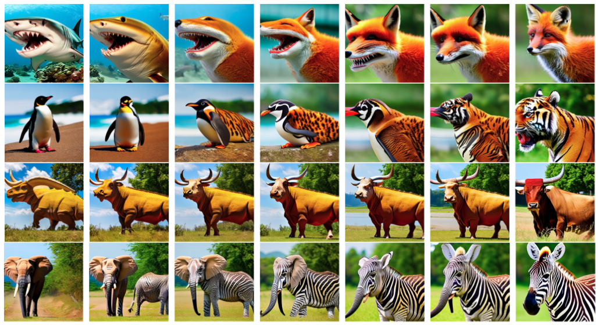
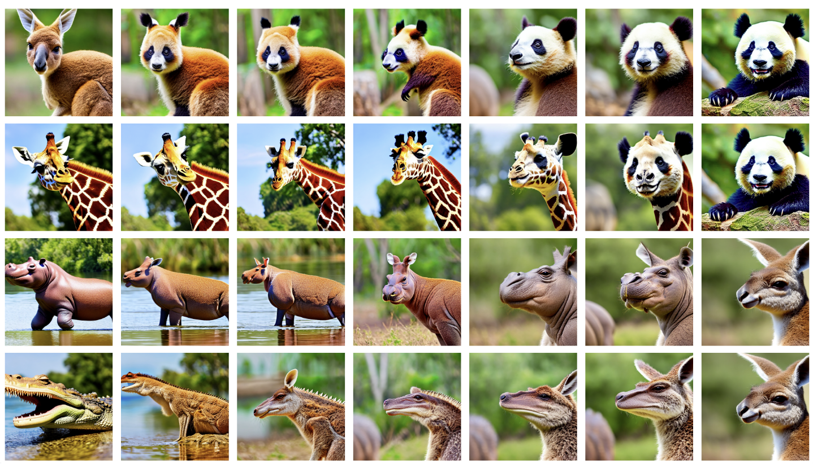

# (P)AID: (Prompt-guided) Attention Interpolation of text-to-image Diffusion

This repository is the official implementation of [AID: Attention Interpolation of text-to-image Diffusion]().

He Qiyuan, Wang Jinghao, Liu Ziwei, Angela Yao


*Our method enables diffusion model to interpolate between two prompts with different prompt guidance.*

## Google Colab

Directly try PAID [here](https://colab.research.google.com/drive/1zC-iOVu_raiFdUAD-TQ76GPKAuIj4hIt?usp=sharing)!

## Local Setup

1. Clone the repository:

```
git clone https://github.com/QY-H00/attention-interpolation-diffusion.git
cd attention-interpolation-diffusion
```
2. Requirements setup:

```
pip install requirements.txt
```

3. Go to `play.ipynb` for fun!

## Results





