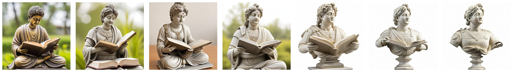

<p align="center">
  
</p>

### <div align="center">PAID: (Prompt-guided) Attention Interpolation of Text-to-Image Diffusion<div>

<p align="center">
NeurIPS 2024 Paper
</p>

<div align="center">
<a href=https://arxiv.org/abs/2403.17924 target="_blank"></a>
<a href=https://huggingface.co/spaces/king159/PAID target="_blank"></a>
<a href=https://colab.research.google.com/drive/1D2myS9UF241gx1otp-fy-LRakMZlROCT?usp=sharing target="_blank"></a>
<a href=https://qy-h00.github.io/attention-interpolation-diffusion target="_blank"></a>
</div>

<p align="center">
  <br>
  <a href="https://qy-h00.github.io" target="_blank">He Qiyuan</a><sup>1</sup>,&nbsp;
  <a href="https://king159.github.io/" target="_blank">Wang Jinghao</a><sup>2</sup>,&nbsp;
  <a href="https://liuziwei7.github.io/" target="_blank">Liu Ziwei</a><sup>2</sup>,&nbsp;
  <a href="https://www.comp.nus.edu.sg/~ayao//" target="_blank">Angela Yao</a><sup>1,&#x2709</sup>;
  </sup></a>
  <br>
  <a herf=https://cvml.comp.nus.edu.sg>Computer Vision & Machine Learning Group, National University of Singapore</a> <sup>1</sup>
  <br>
  S-Lab, Nanyang Technological University <sup>2</sup>
  <br>
  <sup>&#x2709;</sup> Corresponding Author
</p>

## 📌 Release
[10/2024] We are now supporting various application including compositional generation, image morphing, image editing and image-control generation (based on IP-Adapter), try `play_sdxl_application.ipynb` and `play_sd.ipynb` for fun!

[10/2024] We are now supporting interpolating between images via [IP-Adapter](https://github.com/tencent-ailab/IP-Adapter)!

[10/2024] We add dynamic selection pipeline to further improve smoothness, try `play_sdxl_trial.ipynb`!

[10/2024] PAID is accepted as a conference paper by NeurIPS 2024!

[03/2024] Code and paper are publicly available.

## 📑 Abstract

<b>TL;DR: <font color="red">AID</font> (Attention Interpolation via Diffusion)</b> is a training-free method that enables the text-to-image diffusion model to generate interpolation between different conditions with high consistency, smoothness and fidelity. Its variant, <font color="blue">PAID</font>, provides further control of the interpolation via prompt guidance.

<details><summary>CLICK for the full abstract</summary>
Conditional diffusion models can create unseen images in various settings, aiding image interpolation. Interpolation in latent spaces is well-studied, but interpolation with specific conditions like text or poses is less understood. Simple approaches, such as linear interpolation in the space of conditions, often result in images that lack consistency, smoothness, and fidelity. To that end, we introduce a novel training-free technique named Attention Interpolation via Diffusion (AID). Our key contributions include 1) proposing an inner/outer interpolated attention layer; 2) fusing the interpolated attention with self-attention to boost fidelity; and 3) applying beta distribution to selection to increase smoothness. We also present a variant, Prompt-guided Attention Interpolation via Diffusion (PAID), that considers interpolation as a condition-dependent generative process. This method enables the creation of new images with greater consistency, smoothness, and efficiency, and offers control over the exact path of interpolation. Our approach demonstrates effectiveness for conceptual and spatial interpolation.
</details>

## ▶️ PAID Results

<p align="center">

</p>

<p align="center">

</p>

<p align="center">

</p>

<details><summary>CLICK for more results </summary>

#### Aesthetic

<p align="center">

</p>

<p align="center">

</p>

#### Anime

<p align="center">

</p>

<p align="center">

</p>

#### Photorealistic

<p align="center">

</p>

<p align="center">

</p>

</details>

## 📷 Application

<p align="center">

</p>

### Compositional Generation

Given a prompt that involves multiple components (e.g., "A dog driving a car"), we use the compositional description as a guidance prompt, with each related component (e.g., "A dog" and "A car") serving as the prompts at endpoints for interpolation. Under this setting, we apply PAID and then select the image from the interpolation sequence that achieves the highest CLIP score with respect to the compositional description.

<p align="center">

</p>

### Image Editing

We can use [P2P](https://github.com/google/prompt-to-prompt) or [EDICT](https://github.com/salesforce/EDICT) to firstly inverse the generation process of given image, and then set the endpoint condition as the original prompt and the edting prompt, respectively, to control the editing level of images.

<p align="center">

</p>

### Image Morphing

Using IP-Adapter, we set the two images as the condition at the endpoints of the interpolation sequence for image morphing. Notice that the text prompt can be further added to refine the generated images at the endpoints.

<p align="center">

</p>

<p align="center">

</p>

### Image-Control generation

Given a text prompt and an image, we can better control the scale of IP-Adapter by AID. To achieve this, we set one endpoint as only using text prompt as condition while the other endpoint using both text and image condition. This provides smoother control over the scale of IP-Adapter.

<p align="center">

</p>

## 🏍️ Google Colab

Directly try PAID with [Stable Diffusion 2.1](https://colab.research.google.com/drive/1qU62G-EkcGZKSL3QRfQZQZzRuqaF94sB?usp=sharing) or [SDXL](https://colab.research.google.com/drive/1D2myS9UF241gx1otp-fy-LRakMZlROCT?usp=sharing) using Google's Free GPU!

## 🚗 Local Setup using Jupyter Notebook

1. Clone the repository and install the requirements:

``` bash
git clone https://github.com/QY-H00/attention-interpolation-diffusion.git
cd attention-interpolation-diffusion
pip install requirements.txt
```

2. Go to `play.ipynb` or `play_sdxl.ipynb` for fun!

## 🛳️ Local Setup using Gradio

1. install Gradio

``` bash
pip install gradio
```

2. Launch the Gradio interface

``` bash
gradio gradio_src/app.py
```


## 📝 Supporting Models

| Model Name            |  Link                                             |
|-----------------------|-------------------------------------------------------------|
| Stable Diffusion 1.5-512  | [stable-diffusion-v1-5/stable-diffusion-v1-5](https://huggingface.co/stable-diffusion-v1-5/stable-diffusion-v1-5)   |
| Realistic Vision V4.0 | [SG161222/Realistic_Vision_V4.0_noVAE](https://huggingface.co/SG161222/Realistic_Vision_V4.0_noVAE) |
| Stable Diffusion 2.1-768  | [stabilityai/stable-diffusion-2-1](https://huggingface.co/stabilityai/stable-diffusion-2-1) |
| Stable Diffusion XL-1024   | [stabilityai/stable-diffusion-xl-base-1.0](https://huggingface.co/stabilityai/stable-diffusion-xl-base-1.0) |
| Animagine XL 3.1 |   [cagliostrolab/animagine-xl-3.1](https://huggingface.co/cagliostrolab/animagine-xl-3.1)|
| Realistic Vision XL V4.0 | [SG161222/RealVisXL_V5.0](https://huggingface.co/SG161222/RealVisXL_V5.0) |
| Playground v2.5 – 1024 | [playgroundai/playground-v2.5-1024px-aesthetic](https://huggingface.co/playgroundai/playground-v2.5-1024px-aesthetic) |
| Juggernaut XL v9 | [RunDiffusion/Juggernaut-XL-v9](https://huggingface.co/RunDiffusion/Juggernaut-XL-v9) |


## ✒️Citation

If you found this repository/our paper useful, please consider citing:

``` bibtex
@article{he2024aid,
  title={AID: Attention Interpolation of Text-to-Image Diffusion},
  author={He, Qiyuan and Wang, Jinghao and Liu, Ziwei and Yao, Angela},
  journal={arXiv preprint arXiv:2403.17924},
  year={2024}
}
```

## ❤️ Acknowledgement

We thank the following repositories for their great work: [diffusers](https://github.com/huggingface/diffusers), [transformers](https://github.com/huggingface/transformers), [IP-Adapter](https://github.com/tencent-ailab/IP-Adapter), [P2P](https://github.com/google/prompt-to-prompt) and [EDICT](https://github.com/salesforce/EDICT).
